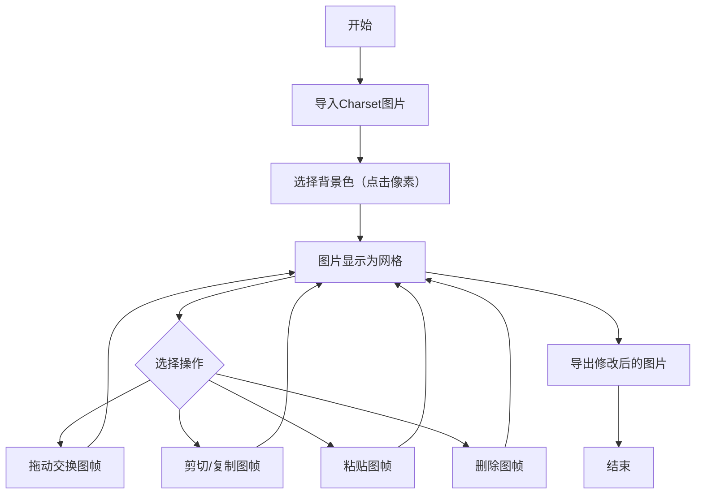

## 1. Product Overview
一款用于可视化整理RM2K（RPG Maker 2000）charset素材的图形化应用。用户可以导入288×256像素的charset图片，通过交互式界面对图帧进行拖动交换、剪切/复制/粘贴/删除等操作，支持多图片同时编辑和跨图片操作。

## 2. Core Features

### 2.1 User Roles
| Role | Registration Method | Core Permissions |
|------|---------------------|------------------|
| User | No registration | Import images, edit frames, export results |

### 2.2 Feature Module
1. **Workspace**: 主工作区，显示所有已导入的charset图片
2. **Image Importer**: 图片导入模块，支持背景色选择
3. **Frame Editor**: 图帧编辑模块，支持拖动交换和剪贴板操作
4. **Toolbar**: 工具栏，提供操作按钮和快捷键提示

### 2.3 Page Details
| Page Name | Module Name | Feature description |
|-----------|-------------|---------------------|
| Workspace | Main Area | 显示多个charset图片的网格视图，支持拖拽选择图帧 |
| Workspace | Toolbar | 导入、导出、剪切、复制、粘贴、删除按钮，撤销/重做功能 |
| Image Importer | Color Picker | 点击图片像素选择背景色，实时预览透明效果 |

## 3. Core Process

## 4. User Interface Design

### 4.1 Design Style
- **主色调**: 深色主题（#1a1a2e）配合青色高亮（#00d4ff）
- **按钮风格**: 扁平化圆角按钮，悬停时有发光效果
- **字体**: 等宽字体用于工具栏标签，无衬线字体用于标题
- **布局**: 卡片式布局，图片网格清晰展示
- **图标**: 简洁线条图标

### 4.2 Page Design Overview
| Page Name | Module Name | UI Elements |
|-----------|-------------|-------------|
| Workspace | Toolbar | 导入按钮、剪贴板操作按钮组、撤销/重做按钮、导出按钮 |
| Workspace | Image Grid | 每个charset图片显示为4×2网格，每个格子为3×4动画帧 |
| Image Importer | Color Picker | 放大预览区域、取色工具、透明度预览 |

### 4.3 Responsiveness
- 桌面优先设计
- 支持响应式布局，工作区可滚动
- 图帧大小自适应窗口

## 5. Technical Requirements
- Charset图片尺寸：288×256像素
- 网格划分：4×2角色区域，每个区域再分为3×4动画帧
- 单帧尺寸：24×32像素（288/4/3=24，256/2/4=32）
- 支持格式：PNG、JPG、GIF