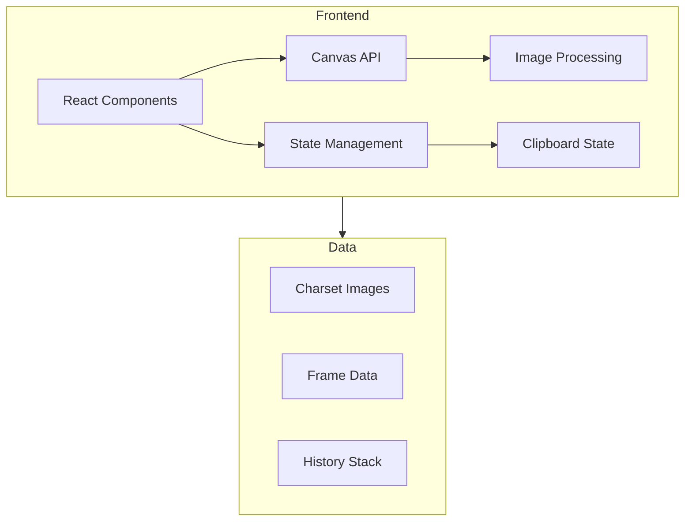

## 1. Architecture Design



## 2. Technology Description
- **Frontend**: React@18 + TypeScript + TailwindCSS@3 + Vite
- **State Management**: Zustand
- **Image Processing**: HTML5 Canvas API
- **Icons**: Lucide React

## 3. Route Definitions
| Route | Purpose |
|-------|---------|
| / | 主工作区，包含所有编辑功能 |

## 4. Data Model

### 4.1 Frame Structure
```typescript
interface Frame {
  id: string;
  imageIndex: number;
  charIndex: number;  // 0-7 (4×2网格)
  animIndex: number;  // 0-11 (3×4动画帧)
  pixelData: ImageData;
}
```

### 4.2 Image Structure
```typescript
interface CharsetImage {
  id: string;
  name: string;
  originalUrl: string;
  canvas: HTMLCanvasElement;
  backgroundColor: string;  // 透明背景色
  frames: Frame[][][];  // 4×2×3×4 结构
}
```

### 4.3 Clipboard State
```typescript
interface Clipboard {
  frames: Frame[];
  operation: 'cut' | 'copy';
}
```

### 4.4 History State
```typescript
interface HistoryEntry {
  operation: 'swap' | 'cut' | 'copy' | 'paste' | 'delete';
  before: Frame[];
  after: Frame[];
}
```

## 5. Core Algorithms

### 5.1 Image Grid Parsing
- 将288×256图片分割为4×2个角色区域（每个72×128像素）
- 每个角色区域再分割为3×4个动画帧（每个24×32像素）
- 应用背景色透明化处理

### 5.2 Frame Drag & Drop
- 跟踪鼠标按下位置，识别源图帧
- 实时预览拖动位置
- 释放时交换源和目标图帧的像素数据

### 5.3 Clipboard Operations
- 剪切：保存图帧数据到剪贴板，清空原位置
- 复制：保存图帧数据到剪贴板，保留原位置
- 粘贴：将剪贴板数据写入目标位置
- 删除：清空目标图帧数据

### 5.4 Cross-image Operations
- 图帧数据独立于所属图片存储
- 粘贴操作可跨图片执行
- 保持图帧尺寸一致性

## 6. Project Structure
```
src/
├── components/
│   ├── Toolbar.tsx          # 工具栏组件
│   ├── CharsetCard.tsx      # Charset图片卡片
│   ├── FrameGrid.tsx        # 图帧网格组件
│   ├── FrameCell.tsx        # 单个图帧单元格
│   ├── ColorPicker.tsx      # 背景色选择器
│   └── ImportModal.tsx      # 导入弹窗
├── hooks/
│   ├── useCharsetStore.ts   # Zustand状态管理
│   └── useDragDrop.ts       # 拖拽逻辑hook
├── utils/
│   ├── imageProcessor.ts    # 图片处理工具
│   ├── frameUtils.ts        # 图帧操作工具
│   └── clipboard.ts         # 剪贴板操作工具
├── types/
│   └── index.ts             # TypeScript类型定义
├── App.tsx                  # 主应用组件
├── main.tsx                 # 入口文件
└── index.css                # 全局样式
```

## 7. Performance Considerations
- 使用离屏Canvas进行像素操作，避免频繁重绘
- 批量更新状态，减少React渲染次数
- 图帧数据使用ImageData对象，高效处理像素